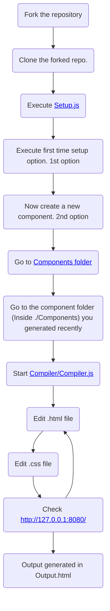

---

- This is an application I made in order to code beautiful mails using only [HTML](https://www.wikiwand.com/en/HTML) and [CSS](https://www.wikiwand.com/en/CSS).
- This application is also inspired by [React js](https://reactjs.org/) framework, hence you can split the mails too in different components, and reuse them whenever needed.

---

Kindly checkout this video for a detailed explanation of this application: https://drive.google.com/file/d/1ZIJ8dnI1pmhsMXD7k1_HeUV5dr0FnEEI/view?usp=sharing

---

## Setting the project

---

---
