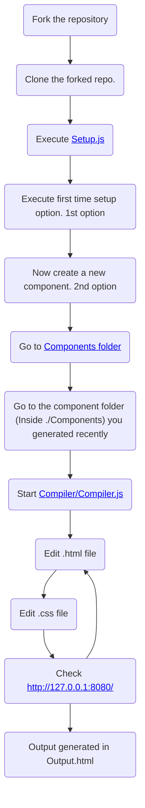

---

- This is an application I made in order to code beautiful mails using only [HTML](https://www.wikiwand.com/en/HTML) and [CSS](https://www.wikiwand.com/en/CSS).
- This application can process all the HTML and CSS files in order to generate an email compatible code in [Output.html](./Output.html).
- Google, linkedin, and all tech giants always code their mails in order to generate beautiful mails.
- This application is also inspired by [React js](https://reactjs.org/) framework, hence you can split the mails too in different components, and reuse them whenever needed.
- Click [here](./Demos/demo1.png) to see a demo.

---

Kindly checkout this video for a detailed explanation of this application: https://drive.google.com/file/d/1ZIJ8dnI1pmhsMXD7k1_HeUV5dr0FnEEI/view?usp=sharing

---

## Setting the project

---

---

## Setup: detailed description

---

1. [Fork](https://docs.github.com/en/get-started/quickstart/fork-a-repo) the repository firstly.
2. Now [clone](https://docs.github.com/en/repositories/creating-and-managing-repositories/cloning-a-repository) the forked repository.
3. Now get into the cloned directory, and execute *npm i* to install all the packages used in this application.
4. Now execute [Setup.js](Setup.js) and select the first option *First time setup*.
5. This will produce all important folders and files required to execute the application.
6. Now create a new component by selecting the second option (*Create component*).
7. After the component is created, you'll observe a folder inside [Compiler](Compiler/) with the same name as that of the newly generated component.
8. Get into that folder, and write some HTML code inside `<component>.html` file. 
9. You can also add styles inside `<component>.css` file.
10. Now add this component into [Prototype.txt](Prototype.txt).
11. Now start the [Compiler/Compiler.js](Compiler/Compiler.js).
12. Compiler will start to convert all css to inline css, and gather all components into the file.
13. Final email compatible code will appear in [Output.html](Output.html).
14. Copy paste this code, and *replace the element of the mail with this code*
15. If you didn't get the above point, then kindly watch [this video](https://youtu.be/ZSSqsEVsChc)