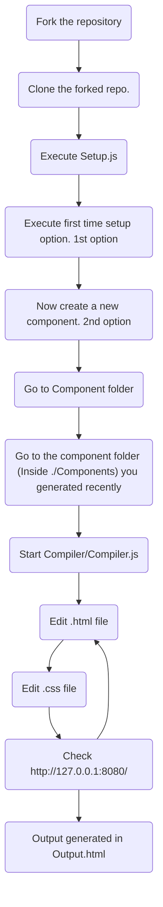

Kindly checkout this video for a detailed explanation of this application: https://drive.google.com/file/d/1ZIJ8dnI1pmhsMXD7k1_HeUV5dr0FnEEI/view?usp=sharing

---

# Setting the project

---

```mermaid
flowchart TB;

fork(Fork the repository) --> clone(Clone the forked repo.)
clone --> setup(Execute Setup.js)
setup --> firstSetup(Execute first time setup option. 1st option)
firstSetup --> createComp(Now create a new component. 2nd option)
createComp --> checkCompFolder(Go to Component folder)
checkCompFolder --> comp("Go to the component folder (Inside ./Components) you generated recently")
comp --> startServer(Start Compiler/Compiler.js)
startServer --> editHtml(Edit <Component>.html file)
editHtml --> editCss(Edit <Component>.css file)
editCss --> checkWebpage(Check http://127.0.0.1:8080/)
checkWebpage --> editHtml
checkWebpage --> output(Output generated in Output.html)
```